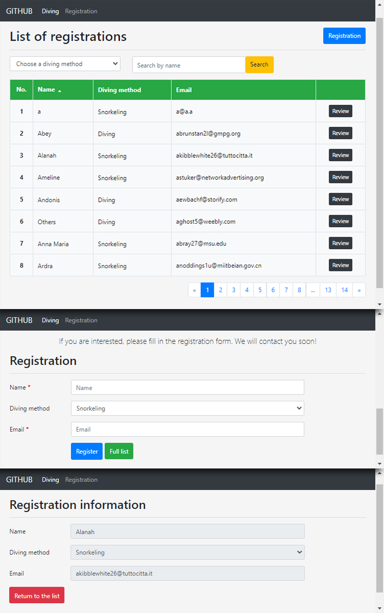

# Diving - Laravel CRUD, search, sort, pagination

I've got a task to create a website, a fictitious online shop with PHP and MySQL. 

**Requirements for the solution:**
* First page - service presentation page with an order form.
* Second page - order list.
* Main features - CRUD, search, sort, pagination.

To implement this I've used the help of an online tutorial
which is, unfortunately, no longer available. 

## Technologies Used

* Laravel 5.6
* MySQL
* Bootstrap 4

## Main Features

* Create
* Read
* Update
* Delete
* Search
* Sort
* Pagination

## Demo

Live project - [https://pocketful-task1.herokuapp.com/](https://pocketful-task1.herokuapp.com/)

## Sources
[Unavailable](http://www.codovel.com/).

 

[:arrow_up_small: **Back To Top**](#top)
